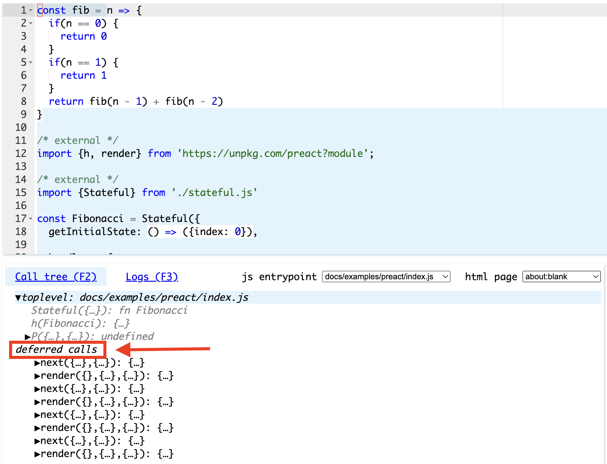
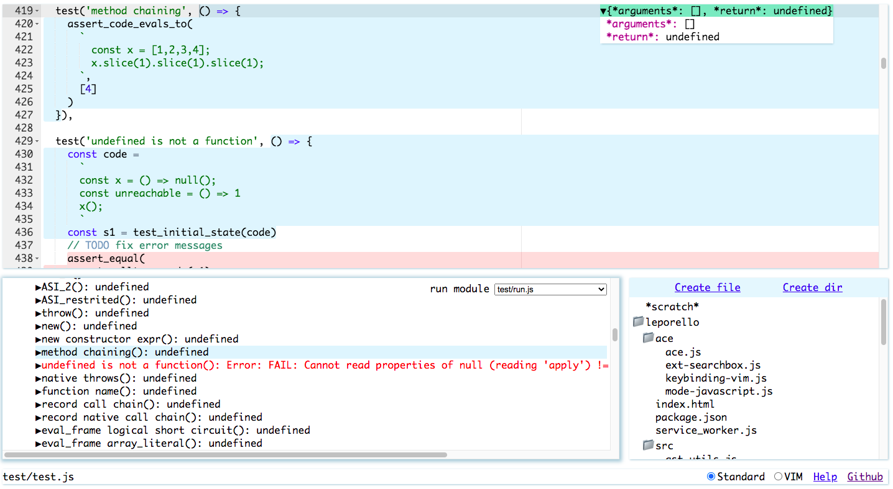

# Leporello.js

Leporello.js is an interactive functional programming environment for JavaScript.

[](https://vimeo.com/845773267)

## **[Website](https://leporello.tech)**
## **[Try online](https://app.leporello.tech)**

## Leporello.js is funded solely by your donations

Support us on [Github Sponsors](https://github.com/sponsors/leporello-js) and be the first to gain access to the Leporello.js Visual Studio Code plugin with TypeScript support.

## Features

### Interactive
Your code is executed instantly as you type, with the results displayed next to it. No need to set breakpoints for debugging. Just move the cursor to any line and see what's happening.

### Designed for functional programming
Supercharge your functional code with unprecedented developer tooling.

### Next level debugging capabilities
Visualise and navigate a dynamic call graph of your program in a time-travel manner.

### Develop HTML5 apps interactively
Modify your code and instantly see the updated version without losing the application state. Interact with your app and debug it later, similar to using a time machine.

### Save time when working on IO-heavy programs
IO operations are traced and transparently replayed on subsequent program executions.

### Self-hosted
Leporello.js source code is developed within Leporello.js itself

## Supported javascript subset

Variables are declared by `const` declaration. `var` is not supported. `let` variables can be declared to be assigned later, for cases when value depends on condition. Example:
```
let result
if (n == 0 || n == 1) {
  result = n
} else {
  result = fib(n - 1) + fib(n - 2)
}
```

Currenlty only one declaration for single `const` statement is supported (TODO).

Any kind of loops are not supported. Use recursion or array functions instead.

`if` / `else` can only contain blocks, not single statements (TODO).

Both traditional functions and arrow functions with block bodies and concise bodies are supported. Method definitions are not supported.

Classes are not supported. Some sort of immutable classes may be supported in future. `this` keyword is not currently supported. `new` operator is supported for instantiating builtin classes.

`switch` statements will be supported in future.

`try`, `catch` and `finally` will be supported in future. `throw` is currently supported.

ES6 modules are suppoted. Circular module dependencies are not supported (currently they crash IDE (TODO)). Import/export aliases are not supported. Exporting `let` variables is not supported. `import.meta` is not supported.

Async and await are supported.

Generators are not supported.

Destructuring is supported.

Some operators are not currently supported:
  - Unary plus
  - Bitwise operators
  - `in`, `instanceof`
  - `void`
  - comma operator

Operators that are not supported by design (not pure functional):
  - increment, decrement
  - `delete`

## Importing third-party libs

Sometimes you want to import third party library that uses imperative language constructs. You may want to use it to perform side-effects or maybe it mutates data inside but still provides functional interface (does not mutate function arguments). Good example of such library is [bignumber.js](https://github.com/MikeMcl/bignumber.js/) - it makes a lot of mutating assignments inside, but `BigNumber` instances are immutable.

To use `bignumber.js` you add an `external pragma` before the import:

```
/* external */
import BigNumber from './path/to/bignumber.mjs';
```

`external pragma` is just a comment that contains only the literal string `external` (both styles for comments and extra whitespaces are allowed). Now the module is imported as a black box - you cannot debug `BigNumber` methods.


Currently every external is loaded once and cached until Leporello is restarted
(TODO change path to modules every time it changed on disk, since modules are
served from service workers).

## IO

To provide interactive experience, Leporello.js traces calls to IO functions
made by your app and can later replay them from trace, allowing to program by
making small iterations on your code and instantly getting feedback.

Current list of builtin functions which calls are traced is:
- `Date`
- `Math.random()`
- `fetch`
- `Response` methods:
    - `arrayBuffer`
    - `blob`
    - `formData`
    - `json`
    - `text`
- `setTimeout`
- `clearTimeout`

Leporello.js traces all IO calls when the code is run for the first time. Then,
every time you edit your code, Leporello.js tries to execute it, taking results
of IO calls from the trace (it is called replay). Traced calls are stored in array.
While replay, when IO call is made, Leporello.js takes next call from the
array, and checks if function and arguments are the same for current call and
traced call. If they are the same, then Leporello.js returns result from the trace. To
compare arguments for equality, Leporello.js uses deep equality comparison with
`JSON.stringify`. Otherwise, the trace gets discarded, and Leporello.js
executes code again, this time without the trace, so the new trace array is
populated.

If you want to discard trace manually, there is a button and a hotkey for this.

## Hotkeys

See built-in Help

## Editing local files

Editing local files is possible via [File System Access API](https://developer.mozilla.org/en-US/docs/Web/API/File_System_Access_API). Click "Allow access to local project folder" to grant access to local directory.

## Selecting entrypoint module

After you granted local filesystem access you can select which javascript file
to run. See the following picture


## Selecting html file

By default code in run in context of empty HTML file. If you want to use custom
HTML files with third party scripts or CSS stylesheets, you should choose HTML
file:


In typical HTML5 app you add to your html file a `script` element pointing to
your entry js module, like this:

```html
<script type='module' src='index.js'></script>
```

Because Leporello has built in bundler, you dont point to your entry module in
HTML file. Instead, you [select entrypoint module in
UI](#selecting-entrypoint-module).

If you want to use the same HTML file both for developing in Leporello.js and
in production, you can do it like this:

```html
<script type='module'>
  if(new URLSearchParams(window.location.search).get('leporello') == null) {
    import('./src/index.js');
  }
</script>
```

Leporello.js appends `?leporello` query parameter to your HTML file, so you can
test if HTML file is run in Leporello.js or in production.

You can add javascript libraries by including `script` tag to HTML file. If the library is exposing globals, they will be available in your javascript code after you select that HTML file as an entrypoint.


## Run and debug UI code in separate window

By default your code is run in invisible iframe. If you want to run and debug
UI code then you can open separate browser window. Click "(Re)open run window"
in statusbar or press corresponding hotkey. New browser window will be opened
and your code will be run in that window.

While you interacting with your app in separate browser tab, all function calls
are recorded. You can inspect and debug them.

To try live example, grant file system access to
[./docs/examples/preact](./docs/examples/preact) folder. Then select `index.js`
as an entrypoint and click "(Re)open run window". You will see the app where
you can calculate Fibonacci numbers:


Try to click buttons and then get back to Leporello window. Now you can see
that all function calls have been recorded and you can inspect and debug
them:



<!--You can even run and debug Leporello.js in Leporello.js! To do this:

- Check out Leporello.js repo and grant local filesystem access to root project directory
- Select `src/launch.js` as an entrypoint
- Select `index.html` as html file
- Click "(Re)open run window"

New instance of Leporello.js will be opened in new browser tab.

The only problem is that both instances of Leporello.js will share the same
localStorage. (TODO - inject localStorage implementation to opened window, that
allows to share localStorage between host Leporello.js instance and window
where code is run)
-->


## Run Leporello locally
To run it locally, you need to clone repo to local folder and serve it via HTTPS protocol (HTTPS is required by [File System Access API](https://developer.mozilla.org/en-US/docs/Web/API/File_System_Access_API)). See [How to use HTTPS for local development](https://web.dev/how-to-use-local-https/)

## Running test suite
run tests in node.js:

```
node test/run.js
```

run tests in leporello itself:



- grant local folder access
- select `test/run.js` as entrypoint


## Roadmap

* Use production level JS parser, probably typescript parser (so it will be
  possible to program in pure functional subset of typescript)
* Implement VSCode plugin
